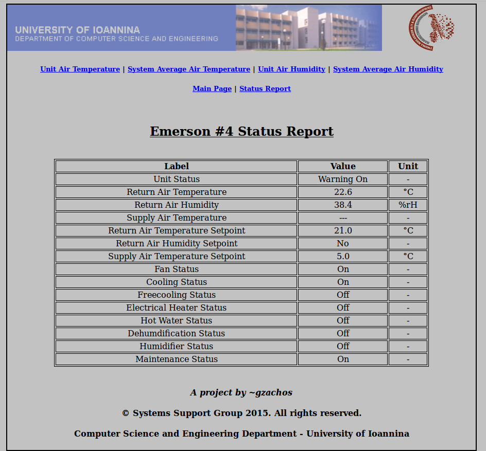
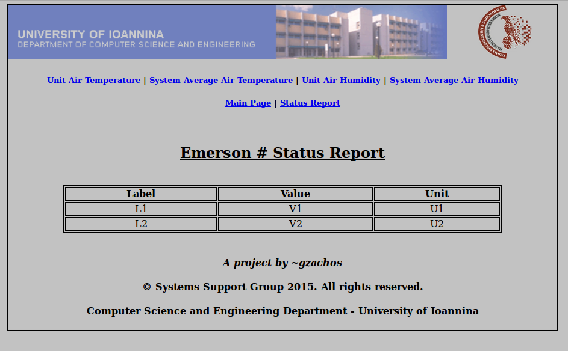
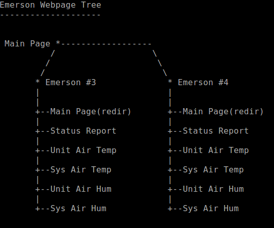

emerson-logger
=============
This repository contains the code developed during the "__Emerson Logger__" project.

About
-----
"__Emerson Logger__" project is about a server that will be used to monitor the environmental conditions of the
_cluster room_ inside the building of [Computer Science and Engineering Department](http://cs.uoi.gr) -
[University of Ioannina](http://uoi.gr). The __temperature__ and __humidity__ values are supplied by the two _Emerson
cooling units_ inside the cluster room. Moreover, the project is about monitoring and the __status__ of the two
Emerson units and __alarm__ the faculty if any __abnormal__ conditions are observed.

Screenshots
-----------
 _Status Report Webpage Example_ 

 _Status Report Webpage Template_ 

 _Emerson Webpage Tree_ 

Licence
-------
[GNU GENERAL PUBLIC LICENSE // Version 2, June 1991](LICENSE)

Assignee
--------
George Zachos
