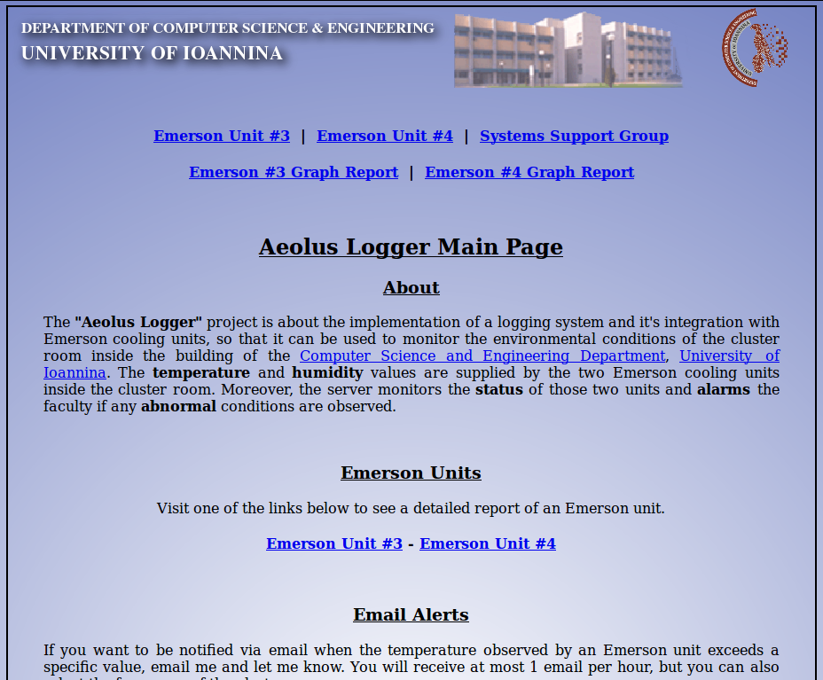
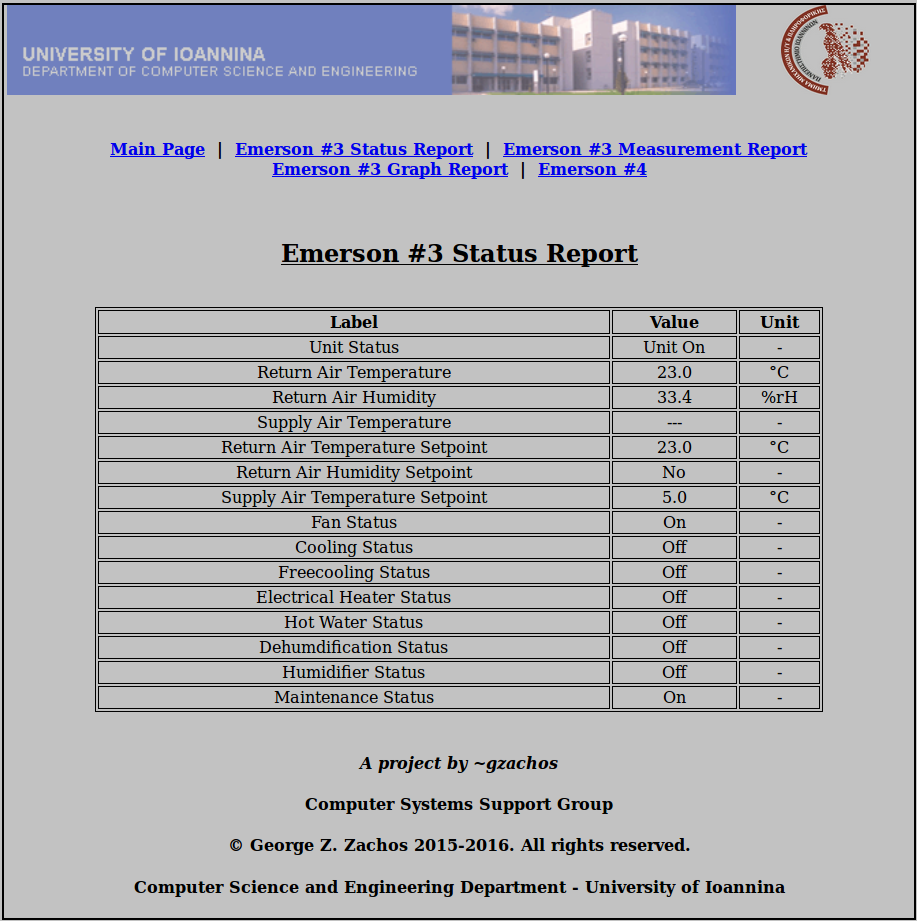
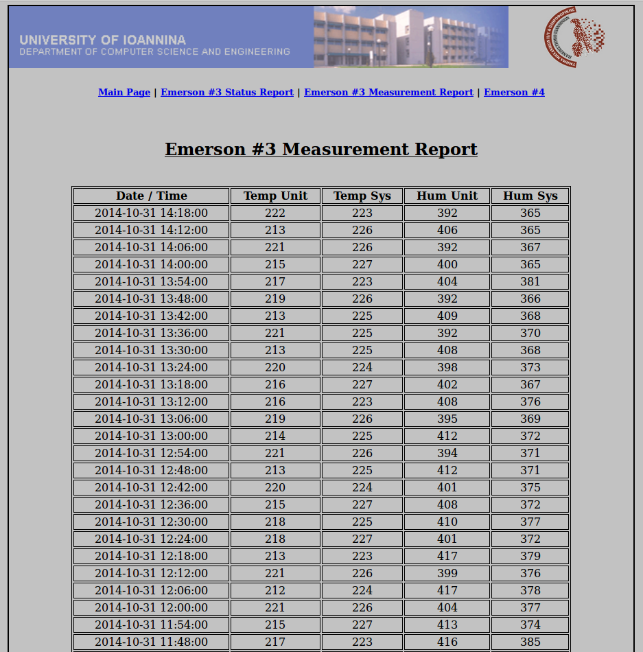
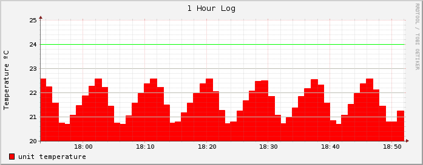
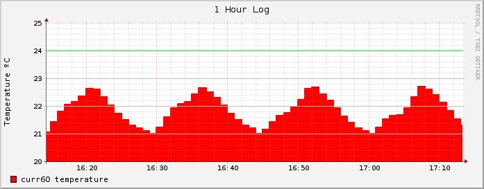
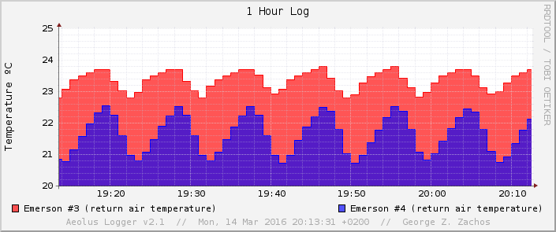
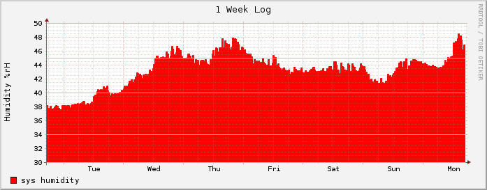
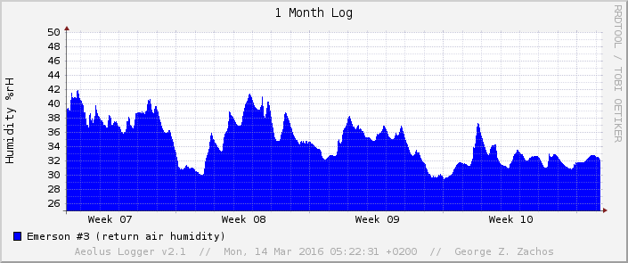
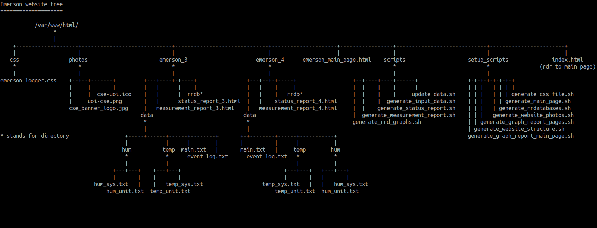
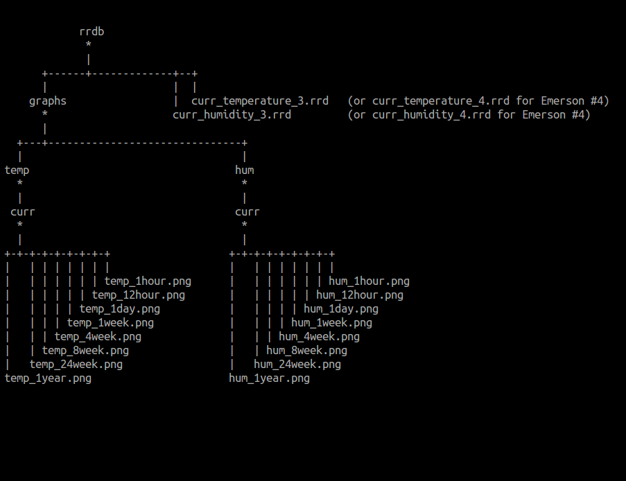

emerson-logger
=============
This repository contains the code developed during the "__Aeolus Logger__" project.

About
-----
"__Aeolus Logger__" project is about the server that monitors the environmental conditions of the
_cluster room_ inside the building of [Computer Science and Engineering Department](http://cs.uoi.gr) -
[University of Ioannina](http://uoi.gr). The __temperature__ and __humidity__ values are supplied by the two _Emerson
cooling units_ inside the cluster room. Moreover, the server monitors and the __status__ of the two
Emerson units and __alarms__ the faculty if any __abnormal__ conditions are observed.

Screenshots
-----------

 _Main Page_ 

 _Status Report_ 

 _Measurement Report_ 

 _Sample graph (1 Hour Temperature Log - Emerson #3)_ 

 _Sample graph (1 Hour Temperature Log 2 - Emerson #4)_ 

 _Sample graph (1 Hour Temperature Log - Emerson #3 & #4)_ 

 _Sample graph (1 Day Humidity Log - Emerson #4)_ 

 _Sample graph (1 Week Humidity Log - Emerson #4)_ 

 _Sample graph (1 Month Humidity Log - Emerson #4)_ 

Website Tree
------------

 _Emerson Website Tree_ 

 _Emerson Website Tree - RRDB directory_ 

Demo
----
[Demo Website](http://cse.uoi.gr/~gzachos/projects/emerson/) (hosted in cse.uoi.gr) [Static - Obsolete data]

Licence
-------
[GNU GENERAL PUBLIC LICENSE // Version 2, June 1991](LICENSE)

Assignee
--------
[George Z. Zachos](http://cse.uoi.gr/~gzachos)
