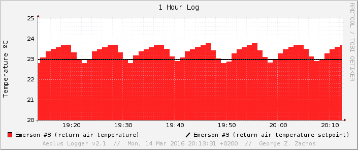
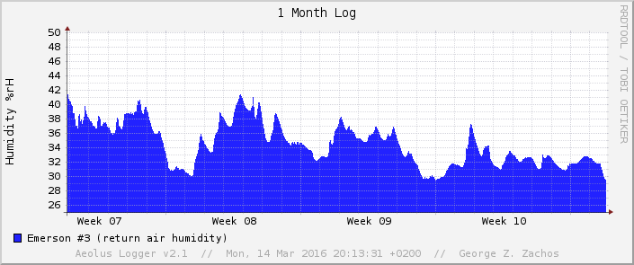

aeolus-logger
=============
This repository contains the code developed during the "__Aeolus Logger__" project.

About
-----
The "__Aeolus Logger__" project is about the implementation of a __logging system__ and it's integration with _Emerson_ cooling units, so that it can be used to monitor the environmental conditions of the __data center__, inside the building of the [Computer Science and Engineering Department](http://cse.uoi.gr), [University of Ioannina](http://uoi.gr). The __Aeolus__ server monitors the __status__ of the _Emerson_ units and __alarms__ the faculty if any __abnormal__ conditions are observed.

Screenshots
-----------

 _Main Page_ 

 _Status Report_ 

 _Measurement Report_ 

 _Graph Report_ 

 _Sample graph (1 Hour Temperature Log - Emerson #3)_ 

 _Sample graph (1 Hour Temperature Log - Emerson #3 & #4)_ 

 _Sample graph (1 Month Humidity Log - Emerson #4)_ 

 _Email Alert_ 

 _Website setup has finished message_ 

 _Website setup has finished with errors message_ 

 Contents of aeolus.log after installation 

W3C valid website
-----------------
The whole website is HTML5 and CSS3 valid, while the RSS feed has been validated too by [W3C](http://www.w3.org/). 

__Validators Used__:
 * [for HTML5](https://validator.w3.org/)
 * [for CSS3](https://jigsaw.w3.org/css-validator/)
 * [for RSS](https://validator.w3.org/feed/)

 

Licence
-------
[GNU GENERAL PUBLIC LICENSE // Version 2, June 1991](LICENSE)

Assignee
--------
[George Z. Zachos](http://cse.uoi.gr/~gzachos)
